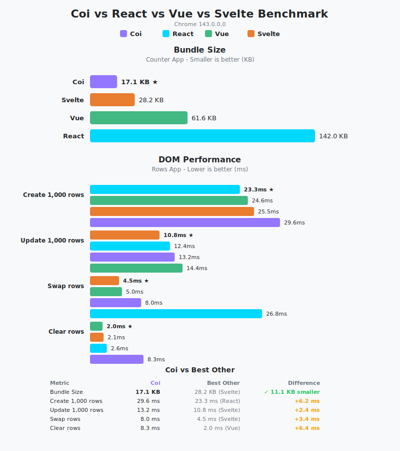

<div align="center">
  

# Coi

[](https://github.com/io-eric/coi/actions/workflows/verify-and-publish.yml)
[](https://opensource.org/licenses/MIT)
[](http://makeapullrequest.com)
[](https://discord.gg/KSpWx78wuR)

A modern, component-based language for building reactive web apps.  
**Type-safe. Fast. WASM-powered.**

Components with native performance. Fine-grained reactivity, zero internal GC pauses, tiny bundles.

</div>

> [!NOTE]
> Coi is actively evolving. Check the documentation and examples for the latest features and syntax.

## What You Can Build

Coi is designed for building reactive, interactive web applications:

- **Web Apps**: Dashboards, admin panels, SPAs with real-time updates
- **Canvas Apps**: Drawing tools, image editors, animations, or games
- **Computation-Heavy Apps**: Simulations, data processing, physics engines, where WASM shines
- **Content Sites**: Blogs, documentation sites, landing pages with dynamic components

Coi gives you composable components, fine-grained reactivity, type safety, and tiny bundle sizes.

## Why Coi?

> [!IMPORTANT]
> Coi isn't another JavaScript framework, it's a new language for the web, built from scratch to feel like a component framework but compile to high-performance WebAssembly. You get static types, strict checking, and native-speed execution without the overhead of a heavy JavaScript runtime.

- **Bundle Size Matters**: In our counter app example, Coi is 40% smaller than Svelte, 72% smaller than Vue, and 88% smaller than React (see [benchmarks](benchmark/)). Faster downloads, faster startup, better mobile experience.
- **Animations & Real-Time Apps**: No garbage collection pauses means consistent 60fps animations and responsive interactions. Perfect for dashboards, games, and live data apps.
- **Type Safety from Day One**: Catch bugs at compile-time, not runtime. Props, state, and platform APIs are fully typed.
- **No Virtual DOM**: Coi uses a fine-grained reactive system. Instead of "diffing" a virtual tree in JS, the compiler generates direct, surgical DOM updates triggered by WASM logic. This eliminates VDOM overhead and minimizes the work the browser has to do.
- **WASM Performance**: Computation-heavy features run at native speed. Great for simulations, physics, data processing, and canvas-based apps.
- **One Codebase, Multiple Platforms** *(Roadmap)*: Web today, native platforms and server-side Coi tomorrow. Full-stack with a single language.

## Features

### Type System & Safety
- **Strict Typing**: Compile-time error checking with strongly typed parameters and state.
- **Reference Parameters**: Pass state by reference with `&` for seamless parent-child synchronization.
- **Move Semantics**: Explicit ownership transfer with `:` to prevent accidental copying.
- **Private by Default**: Component members are private; use `pub` to expose them.

### Developer Experience
- **Component-Based**: Composable, reusable components with props, state, and lifecycle blocks.
- **Integrated DOM & Styling**: Write HTML elements and scoped CSS directly in components.
- **View Control Flow**: Declarative `<if>`, `<else>`, `<for>` tags for conditional rendering and iteration.
- **Component Lifecycle**: Built-in `init {}`, `mount {}`, and `tick {}` blocks for setup and animations.
- **Type-Safe Platform APIs**: Full type safety for Canvas, Storage, Audio, Fetch, and other browser APIs.
- **Editor Extensions**: Syntax highlighting and completions available for [VS Code, Sublime Text, and Zed](docs/tooling.md).

## Example

```tsx
component Counter(string label, mut int& value) {
    def add(int i) : void {
        value += i;
    }

    style {
        .counter {
            display: flex;
            gap: 12px;
            align-items: center;
        }
        button {
            padding: 8px 16px;
            cursor: pointer;
        }
    }

    view {
        <div class="counter">
            <span>{label}: {value}</span>
            <button onclick={add(1)}>+</button>
            <button onclick={add(-1)}>-</button>
        </div>
    }
}

component App {
    mut int score = 0;

    style {
        .app {
            padding: 24px;
            font-family: system-ui;
        }
        h1 {
            color: #1a73e8;
        }
        .win {
            color: #34a853;
            font-weight: bold;
        }
    }

    view {
        <div class="app">
            <h1>Score: {score}</h1>
            <Counter label="Player" &value={score} />
            <if score >= 10>
                <p class="win">You win!</p>
            </if>
        </div>
    }
}

app {
    root = App;
    title = "My Counter App";
    description = "A simple counter built with Coi";
    lang = "en";
}
```

## Benchmarks

In [benchmarks](benchmark/) comparing Coi, React, Vue, and Svelte, Coi delivers the smallest bundle size and competitive DOM performance. See the results below:

<p align="center">
  
</p>


## Quick Start

### Install

**Prerequisites:**
- Clang 16+ (required for full C++20 support)
  - Ubuntu/Debian: `sudo apt install clang-16`
  - macOS: `brew install llvm lld`
  - Fedora: `sudo dnf install clang`

```bash
git clone https://github.com/io-eric/coi.git
cd coi
./build.sh
```

### Create a Project

```bash
coi init my-app
cd my-app
coi dev
```

Open `http://localhost:8000` in your browser.

### CLI Commands

| Command | Description |
|---------|-------------|
| `coi init [name]` | Create a new app project |
| `coi init [name] --pkg` | Create a new package |
| `coi build` | Build the project |
| `coi dev` | Build and start dev server (with hot reload) |
| `coi dev --no-watch` | Dev server without hot reload |
| `coi add <package>` | Add a package from registry |
| `coi install` | Install packages from coi.lock |
| `coi remove <package>` | Remove a package |
| `coi update [package]` | Update package(s) to latest |
| `coi list` | List installed packages |
| `coi version` | Show the Coi compiler version |
| `coi <file.coi> --out <dir>` | Compile a single file |

### Project Structure

```
my-app/
├── assets/
│   └── images/
├── src/
│   ├── App.coi          # Entry point (required)
│   ├── layout/
│   │   ├── Footer.coi
│   │   └── NavBar.coi
│   ├── pages/
│   │   ├── About.coi
│   │   └── Home.coi
│   └── ui/
│       └── Button.coi
├── styles/
│   └── reset.css
├── dist/                # Build output
└── README.md
```

- **`src/App.coi`** — The compiler always looks for this as the entry point.
- **`assets/`** — Automatically copied to `dist/assets/` on build.
- **`styles/`** — CSS files here are bundled into `app.css`.

## Documentation

- [Getting Started](docs/getting-started.md): Installation, first project, imports
- [Language Guide](docs/language-guide.md): Types, enums, control flow, operators
- [Components](docs/components.md): State, lifecycle, props, references
- [View Syntax](docs/view-syntax.md): JSX-like templates, `<if>`, `<for>`, events
- [Styling](docs/styling.md): Scoped and global CSS
- [Platform APIs](docs/api-reference.md): Canvas, Storage, Audio, Fetch, and more
- [Editor Support](docs/tooling.md): VS Code, Sublime Text, and Zed extensions

## Community

Join the Coi community on Discord to get help, share projects, and discuss the language:

**[Join Discord Server](https://discord.gg/KSpWx78wuR)** 💬

## Editor Support

Coi has syntax highlighting and language support for VS Code, Sublime Text, and Zed.

See the [Editor Support & Tooling](docs/tooling.md) documentation for installation instructions and features.

## License

MIT © [io-eric](https://github.com/io-eric)
